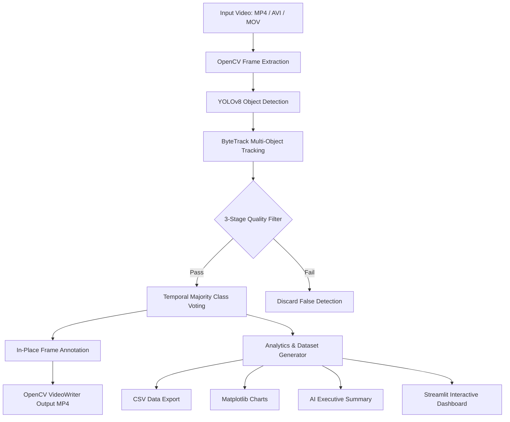

# VisionGuard AI — Real-Time Video Intelligence & Analytics Platform

> **Author:** Karan ([@karancoding08](https://github.com/karancoding08))  
> **Domain:** Computer Vision, Deep Learning, Video Analytics  
> **Tech Stack:** Python 3.11, PyTorch, YOLOv8, ByteTrack, OpenCV, Streamlit, Pandas, Matplotlib  

---

## 📌 Project Overview

**VisionGuard AI** is an advanced, production-grade video intelligence platform engineered for automated object detection, multi-object tracking (MOT), and analytical summary generation. 

Built using **YOLOv8** (State-of-the-Art Deep Learning Detector) and **ByteTrack** (Real-Time Association Tracker), VisionGuard AI processes raw video feeds (MP4, AVI, MOV) to track unique objects across frames, filter out visual noise, and produce downloadable annotated videos along with CSV datasets and analytical dashboards.

---

## ✨ Key Features & Technical Innovations

### 1. 🛡️ 3-Stage Noise Reduction & False Positive Filtering
To ensure high accuracy in complex indoor/outdoor environments, a custom 3-stage validation pipeline was implemented:
- **Spatial Dimension Sanity:** Bounding boxes smaller than 10x10 pixels or total area $< 300\text{ px}^2$ are automatically pruned as sensor noise.
- **Rolling Confidence Variance Gate:** Monitors confidence score variance ($\sigma^2$) across rolling 4-frame windows. Detections exhibiting high erratic variance ($> 0.015$) are flagged as unstable and suppressed.
- **Consecutive Frame Persistence:** Requires an object track to persist for at least **2 consecutive frames** before validating its physical presence, eliminating 1-frame glitches (e.g., misinterpreting a chair as a bed or a car as a train).

### 2. 🗳️ Temporal Majority Voting for Class Jitter
Deep learning object detectors can occasionally flicker between class labels across consecutive frames (e.g., `Car` $\rightarrow$ `Train` $\rightarrow$ `Car`).
- Implemented a per-track class history buffer using `collections.Counter`.
- Automatically assigns the **statistical mode (most frequent label)** observed across the object's entire trajectory, guaranteeing zero label flickering.

### 3. 🎯 Configurable Detection Modes
The inference engine supports target filtering prior to annotation and statistics calculation:
- **All Objects:** Tracks all 80 COCO dataset classes dynamically.
- **People Only:** Strictly filters and tracks `person` instances.
- **Vehicles Only:** Focuses exclusively on traffic objects (`car`, `bus`, `truck`, `motorcycle`, `bicycle`).

### 4. ⚡ Single-Pass Streaming Architecture
Optimized for live demonstration on standard CPU/GPU setups:
- Single-pass video decoding and writing without storing raw frame buffers in memory.
- In-place canvas annotation (`in_place=True`) to minimize RAM allocation overhead.
- Automatic hardware acceleration (PyTorch CUDA GPU if detected, with optimized CPU fallback).

---

## 📐 System Architecture



---

## 🗂️ Project Structure

```
VisionGuard-AI/
├── app.py               # Streamlit UI dashboard, sidebar controls & reactive state
├── detector.py          # YOLOv8 model loader, inference wrapper & drawing utilities
├── video_processor.py   # Single-pass frame processing, tracking & 3-stage filtering pipeline
├── utils.py             # Palette color mapping, CSV exporter & AI summary generator
├── requirements.txt     # Python dependency specifications
├── README.md            # Comprehensive project documentation
├── uploads/             # Input video storage directory
└── outputs/             # Processed videos, CSV reports, and analytics outputs
```

---

## ⚙️ Installation & Setup

### Prerequisites
- Python 3.11+ installed
- Git installed
- NVIDIA GPU (Optional, CUDA supported)

### 1. Clone the Repository
```bash
git clone https://github.com/karancoding08/VisionGuard-AI.git
cd VisionGuard-AI
```

### 2. Create and Activate Virtual Environment
```bash
# Windows
python -m venv .venv
.venv\Scripts\activate

# Linux / macOS
python3 -m venv .venv
source .venv/bin/activate
```

### 3. Install Dependencies
```bash
pip install -r requirements.txt
```

---

## 🚀 Running the Application

Execute the following command in your terminal:

```bash
python -m streamlit run app.py
```

After launching, open your browser at `http://localhost:8501`.

---

## 📊 Performance & System Verification

| Parameter | Value / Default | Details |
|---|---|---|
| Default Model | `yolov8s.pt` | Small variant (~11.2M params) offering 3x faster inference on CPU |
| Default Confidence | `0.60` | High-precision threshold for strict validation |
| Default IoU | `0.60` | NMS bounding box overlap threshold |
| Target Devices | CUDA / CPU | Auto-detected PyTorch hardware device |

---

## 👨‍💻 Developer & Attribution

Developed by **Karan** ([@karancoding08](https://github.com/karancoding08)) as a Major Computer Science & Artificial Intelligence Project. 

*Designed, implemented, and verified independently.*
